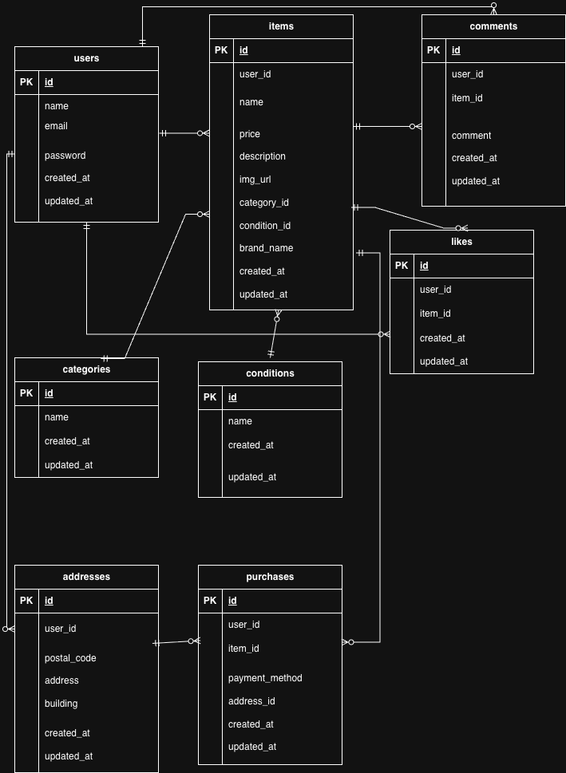

# Furima App

フリマアプリを模したECサイトです。

## 環境構築

### Dockerビルド

```bash
docker-compose up -d --build
```
### Laravel環境構築

```bash
docker-compose exec php bash
composer install
cp .env.example .env
php artisan key:generate
php artisan migrate
php artisan db:seed
```

## 使用技術

- PHP
- Laravel
- MySQL
- Docker
- nginx

## ER図


